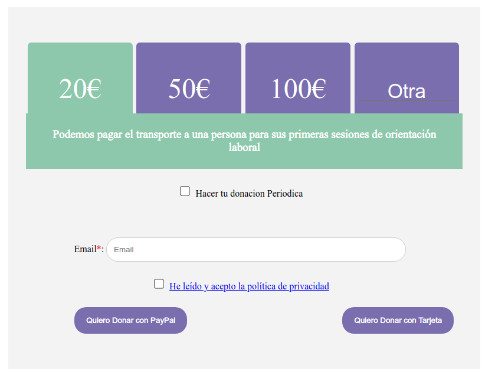
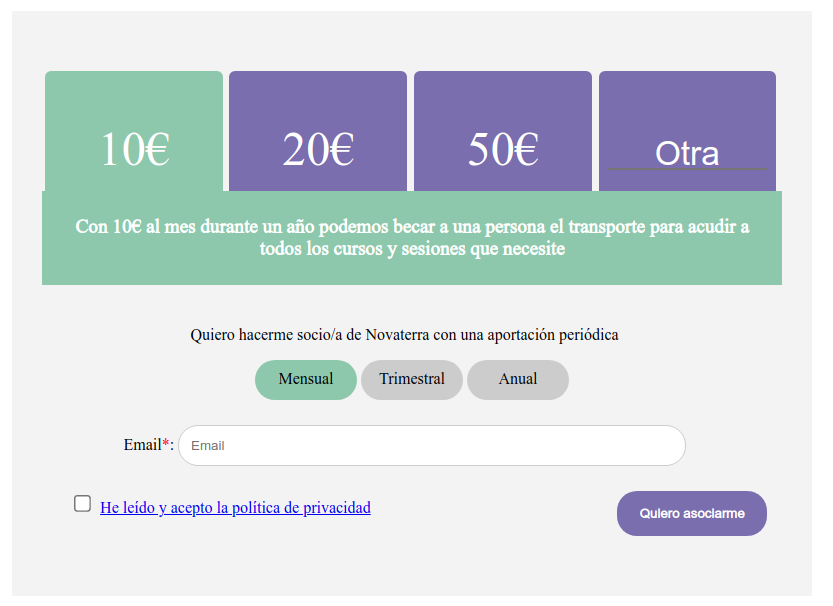

# Formulario de donacion para Ong

He desarrollado dos formularios de asociación y de donación con la selección de importe para una ONG. Aprovechado que ya esta hecho, lo comparto para que lo use el que lo pueda necesitar.

Esta hecho con javascript y en este caso esta integrado con en un wordpress pero es es integrable en cualquier otro sistema no interacciona nada con el wp.

Los formularios estan en la carpeta donacion, 

Existen otras dos carpeta heredadas de otros proyectos la api_send_email el un script en php que hace el envio de emails, puede  usarse este o el sistema que se disponga. Al igual que la carpeta tpv-pago e los que permite hacer los pagos con servired, es una adaptacion del proyecto https://github.com/eusonlito/redsys-TPV

### formulario de donaciones

### formulario de asociacion

